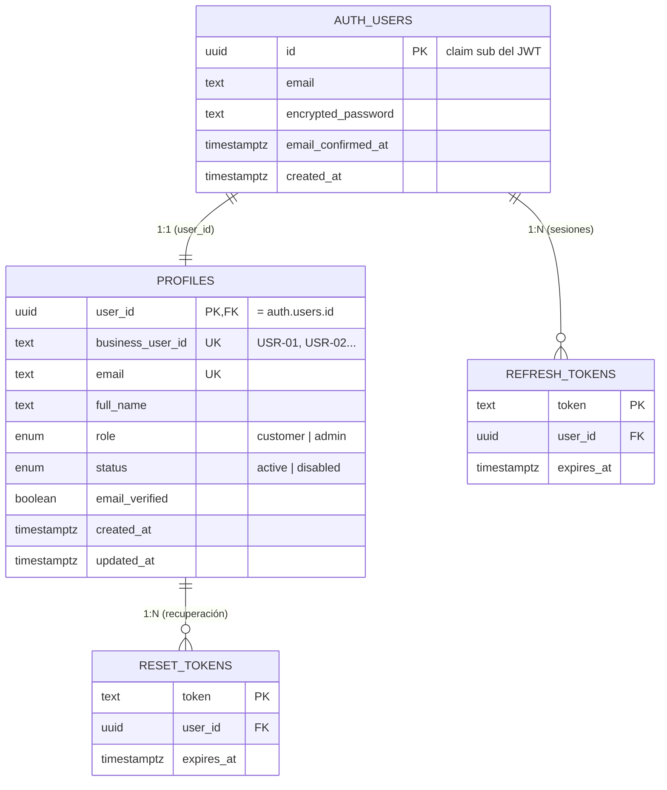

# Modelo de datos — Identity Service (G2)

Servicio responsable de **identidad, usuarios y sesiones** del Minimarketplace.
Backend de autenticación: **Supabase Auth** (emite JWT + refresh token).
Persistencia de perfil/roles: **PostgreSQL (Supabase)**, tabla `public.profiles`.

> En el mock, estas entidades viven en memoria (`src/store/memoryStore.js`) con
> la **misma forma**. Al activar Supabase se usan las tablas reales sin cambiar
> el contrato de salida.

---

## 1. Diagrama entidad-relación

---

## 2. Identificadores de usuario (clave para integrar con otros grupos)

Una misma persona tiene **dos** identificadores, en relación **1:1**. G2 es el
dueño y responsable de mantener el mapeo.

| Identificador      | Tipo   | Origen                     | Lo usa…                                  | Ejemplo                                  |
|--------------------|--------|----------------------------|------------------------------------------|------------------------------------------|
| `user_id`          | UUID   | Supabase Auth (`auth.users`) | Identidad interna; viaja en el claim `sub` del JWT | `3d9a1f44-1b2a-4c3d-8e5f-aabbccddeeff` |
| `business_user_id` | string | G2 (`profiles`)            | G4 (Carro), G5 (Pedidos), G9 (Notificaciones) | `USR-01`                              |

`GET /auth/validate` y `UserProfile` exponen **ambos**, para que cualquier
servicio pueda cruzar el JWT contra sus propios datos sin mantener un mapeo
aparte.

---

## 3. Entidad `profiles` (detalle de campos)

| Campo              | Tipo          | Reglas / notas                                                         |
|--------------------|---------------|------------------------------------------------------------------------|
| `user_id`          | uuid (PK, FK) | `= auth.users.id`. Identidad interna. No cambia nunca.                  |
| `business_user_id` | text (unique) | Legible (`USR-NN`). Puede ser `null` si aún no se asigna.               |
| `email`            | text (unique) | Formato email. Único en el sistema.                                    |
| `full_name`        | text          | Requerido, mínimo 1 carácter.                                         |
| `role`             | enum          | `customer` (default) \| `admin`.                                       |
| `status`           | enum          | `active` (default) \| `disabled`. `disabled` ⇒ `/auth/validate` → 403. |
| `email_verified`   | boolean       | Refleja `email_confirmed_at` de Supabase Auth.                         |
| `created_at`       | timestamptz   | Fecha de creación de la cuenta.                                        |
| `updated_at`       | timestamptz   | Última modificación (trigger la mantiene al día).                      |

### Enums

- **Role:** `customer`, `admin`
- **Status:** `active`, `disabled`

---

## 4. Entidades de sesión (gestionadas por Supabase Auth)

| Entidad          | Propósito                                              | Vida útil (mock)     |
|------------------|-------------------------------------------------------|----------------------|
| `access_token`   | JWT de vida corta; autoriza las requests (`Bearer`).  | `3600 s` (config)    |
| `refresh_token`  | Renueva el access token sin re-login. Se rota al usar. | `30 días` (config)  |
| `reset_token`    | Token temporal de recuperación de contraseña (email). | `15 min`             |

Reglas de invalidación:
- `change-password` y `reset-password` ⇒ se revocan las demás sesiones.
- `logout` ⇒ revoca la sesión indicada (o todas las del usuario si no se pasa `refresh_token`).
- Cambiar `status` a `disabled` ⇒ se revocan las sesiones activas y `/auth/validate` responde 403.

---

## 5. Reglas de negocio que el modelo garantiza

1. **Email único** en todo el sistema (registro duplicado ⇒ `409 EMAIL_ALREADY_EXISTS`).
2. **Política de contraseña**: mínimo 8 caracteres (⇒ `422 WEAK_PASSWORD`).
3. **Rol por defecto** `customer` y **estado** `active` al registrarse.
4. **Mapeo 1:1** `user_id ↔ business_user_id` mantenido por G2.
5. Sólo **admin** lista/edita usuarios ajenos, cambia rol o estado (⇒ `403 FORBIDDEN` si no).
